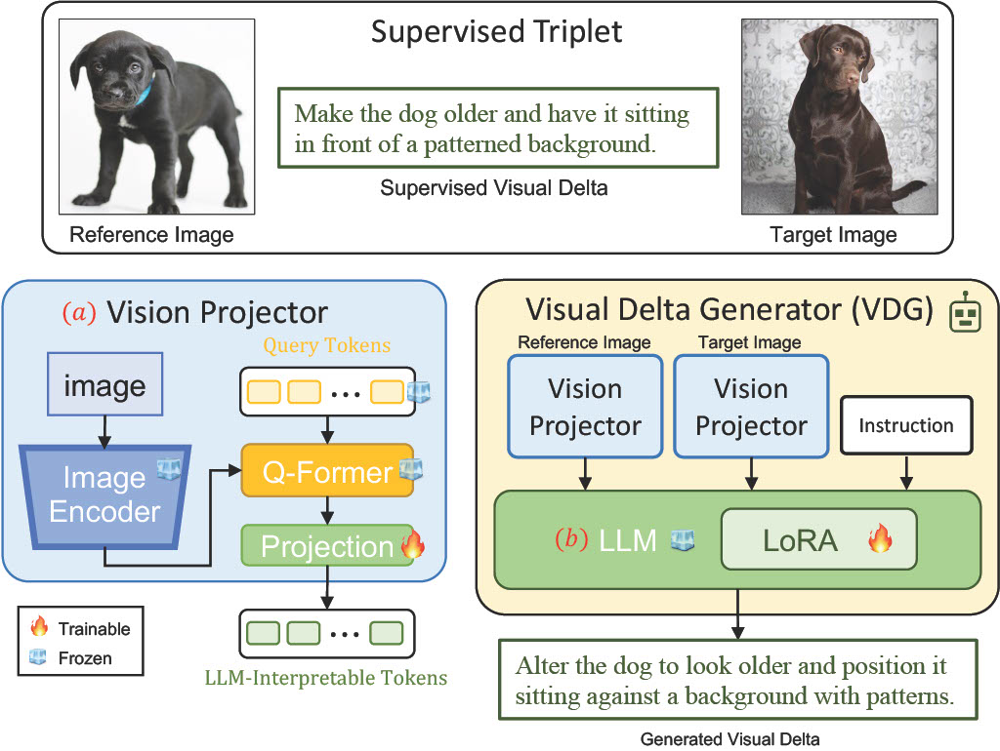
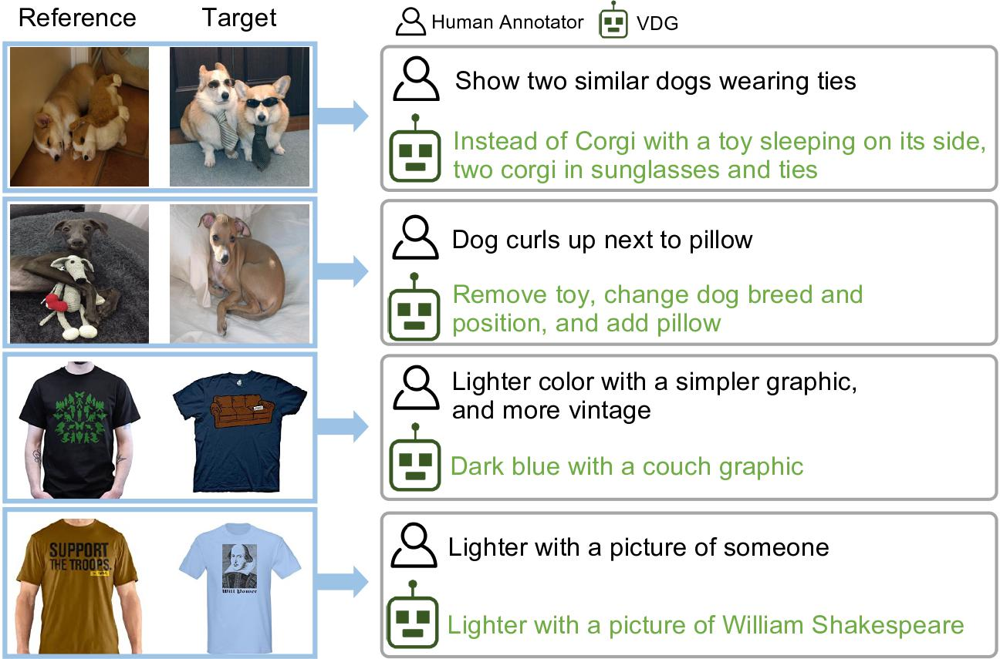

# (2024CVPR) Visual Delta Generator with Large Multi-modal Models for Semi-supervised Composed Image Retrieval
### [Project Page]() | [Paper](https://arxiv.org/abs/2404.15516)
The official repository of "**VDG**".

## Model Overview
<p align="center">

</p>

## VDG Generated Examples
<p align="center">

</p>

## Requirements
You can install the conda environment by running:
```bash
git clone https://github.com/youngkyunJang/VDG.git
cd VDG
pip install -e .
```
## Datasets
Please follow the instructions in [CIRR](https://www.zheyuanliu.me/CIRR/) [FashionIQ] (https://github.com/XiaoxiaoGuo/fashion-iq)

We provide json files with CIRR original training set (cirr_train), VDG generated captions included one (cirr_train_combined), and test set (cirr_test).
```
├── datasets
    └── cirr_train.json
    └── cirr_train_combined.json
    └── cirr_test.json
```

## Running

### Download LLM and Q-Former pretraining model
We utilize LLaMA2-13B model from Meta AI [link](https://llama.meta.com/llama2/) and lit-llama from Lightning-AI to LoRA tuning [link](https://github.com/Lightning-AI/lit-llama).
We utilize pre-trained Q-Former from InstructBLIP [paper](https://arxiv.org/abs/2305.06500) and use weights from Huggingface [link](https://huggingface.co/docs/transformers/model_doc/instructblip).

### VDG Training
Run below command to train VDG, default is 10 epochs, lora_r=16, qf_model=instructblip-vicuna-13b,

```
python instruction_tuning/lora_cirr.py --llama_path $put_path_of_LLM --llama_path 13B
```

### CIR Model Training
Run below command to train CIR model using VDG generated captions, we provide VDG generated ones (cirr_train_combined.json)
If you want to add auxiliary gallery to perform semi-supervised learning, using VDG to generate visual deltas, and make json format same to cirr_train, and put it on ```--extra_dataset```

```
python main_train/BLIP_tdm.py --dataset datasets/cirr_train_combined.json
```

### Evaluation
We also provide test code which can run as below:
```
python main_test/cirr/BLIP_cirr.py --ckpt $put_trained_CIR_model_path
```

```latex
@inproceedings{jang2024visual,
  title = {Visual Delta Generator with Large Multi-modal Models for Semi-supervised Composed Image Retrieval},
  author={Jang, Young Kyun and Kim, Donghyun and Meng, Zihang and Huynh, Dat and Lim, Ser-Nam},
  booktitle = {Proceedings of the IEEE/CVF Conference on Computer Vision and Pattern Recognition (CVPR)},
  year = {2024}
}
```

